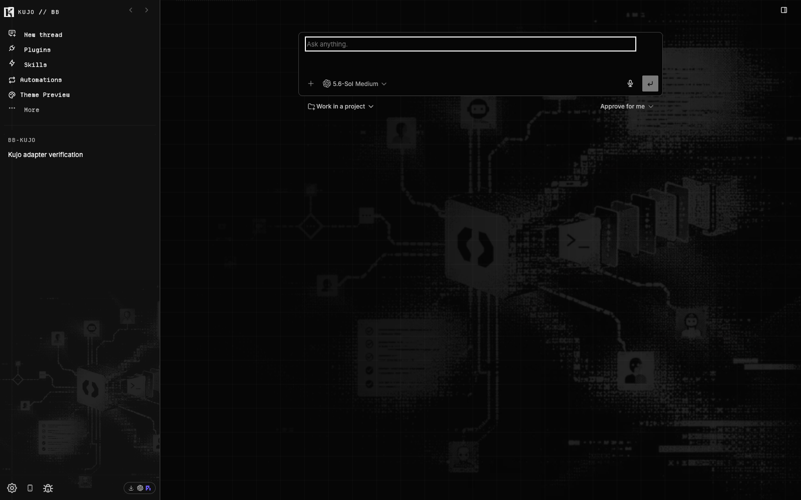
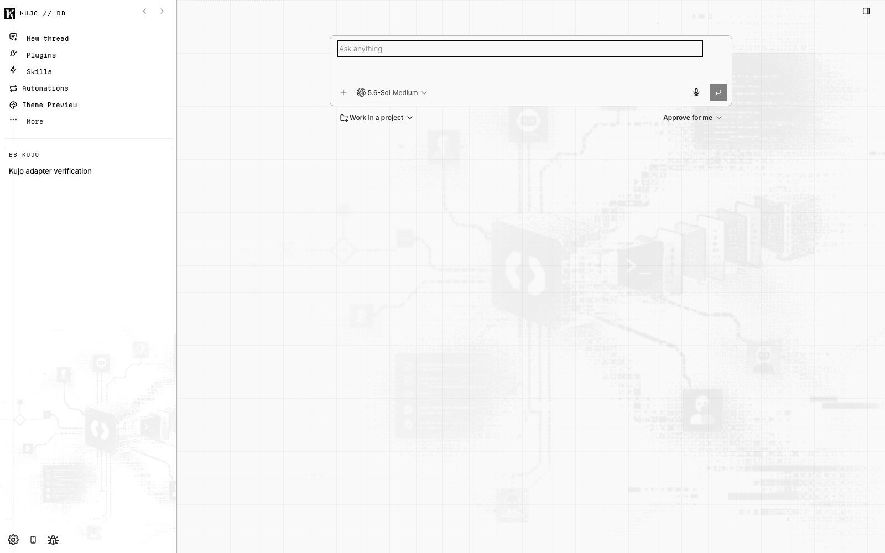

# Kujo // bb

A mechanical workspace skin for bb, built from Kujo and SiteKit.

Paper and ink. Hard edges. Quiet signal noise.





## What it changes

- Native **Kujo** light and dark palettes for bb's shell, conversations, controls and panels.
- Matching code, terminal and diff colors, generated from one semantic token source.
- Bundled Departure Mono for navigation, tabs, headings and code; readable local sans for conversations.
- Tabler outline icons through bb’s native registry, with native artwork restored outside Kujo.
- The actual kujolang.ai workflow artwork, mechanical rails, a Kujo shell mark and brief background slice glitches.
- Visible keyboard focus, readable metadata and reduced-motion support.

No analytics, telemetry, remote fonts, runtime network calls or bb fork. Only decorative artwork shifts; text and controls stay still. Native theme switching removes the background and the content-script disposer removes its edge layer.

## Install

Requires bb **0.43.x**. Install from the public repository:

```sh
bb plugin install git:https://github.com/kujolang/bb-kujo.git --yes
bb theme set plugin:bb-kujo:kujo
```

Or build a local checkout:

```sh
git clone https://github.com/kujolang/bb-kujo.git
cd bb-kujo
npm ci
npm run build
bb plugin install "path:$PWD" --yes
bb theme set plugin:bb-kujo:kujo
```

Select **Light**, **Dark**, or **System** under Settings → Appearance. Both appearances share the same Kujo theme entry. `bb` must be on PATH; the bb-app npm package also provides the CLI. Generated theme assets are committed for Git installs.

Remove with `bb plugin remove bb-kujo`. Choose another palette with `bb theme set default`.

## Develop

```sh
npm ci
npm run dev
```

The watcher serializes generation, `bb plugin build .`, and `bb plugin reload bb-kujo`. Install the plugin once before starting it. Edit `themes/palette.json`, `themes/palette-light.json`, `themes/surfaces.css`, `themes/signal.css`, or `src/`; do not edit generated `kujo.css`, `tokens.css`, or `kujo-code.json`.

```sh
npm run check         # generated assets, TypeScript, contracts and contrast
npm run build         # includes bb's actual plugin compiler
npm run qa            # Chrome lifecycle, motion, focus and idle comparison
BB_SERVER_URL=http://127.0.0.1:48896 node scripts/host-qa.mjs
BB_SERVER_URL=http://127.0.0.1:48896 node scripts/signature-qa.mjs
BB_SERVER_URL=http://127.0.0.1:48896 BB_QA_THREAD_ID=YOUR_TEST_THREAD node scripts/workspace-qa.mjs
BB_SERVER_URL=http://127.0.0.1:48896 BB_QA_APPEARANCE=light node scripts/signature-qa.mjs
BB_SERVER_URL=http://127.0.0.1:48896 BB_QA_THREAD_ID=YOUR_TEST_THREAD BB_QA_APPEARANCE=light node scripts/workspace-qa.mjs
npm pack --dry-run
```

Host QA requires an isolated running bb with Kujo and the bundled Theme Preview plugin installed. It changes that instance's theme and reloads/disables/re-enables Kujo. Workspace QA additionally opens a file, types/undoes unsaved editor text, and creates a terminal in the supplied disposable thread. Do not point either check at an active work session. Chrome is used through Playwright; `KUJO_BROWSER=chromium` selects an installed Playwright Chromium.

## Screenshots and evidence

[All screenshots](screenshots/README.md) · [QA results](docs/qa.md) · [Architecture](docs/architecture.md) · [Compatibility](docs/compatibility.md) · [Typography and icons](docs/typography-icons.md) · [Source review](docs/research.md)

Workspace screenshots use bb's real thread, Monaco, file tree and xterm surfaces with an offline echo fixture. `preview-*` and overlay screenshots use bb's bundled Theme Preview fixtures, not a recreated bb interface.

## Limits

Light and dark. No native-device certification. Third-party iframes and hard-coded plugin colors remain outside the host palette. bb couples terminal background to sidebar tone; its Monaco theme bridge is experimental. Every internal selector is documented, and the supported bb version range is deliberately narrow.

For motion-sensitive users, `prefers-reduced-motion: reduce` disables the signal animation. Narrow/touch views omit it. The static design needs no animation.

## Release

MIT. [Font and design attribution](THIRD_PARTY_NOTICES.md) · [Release notes](CHANGELOG.md) · [Marketplace preparation](docs/marketplace.md)

The repository includes a self-hosted marketplace catalog. bb-community approval is not claimed. Stock bb 0.43.0 has a separately verified [Monaco disposal repair](docs/monaco-compatibility.md); full workspace QA passes with that repair applied. It is never applied automatically by this skin.
